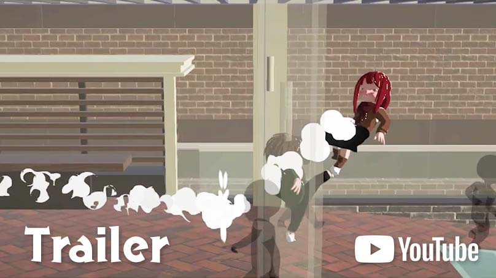
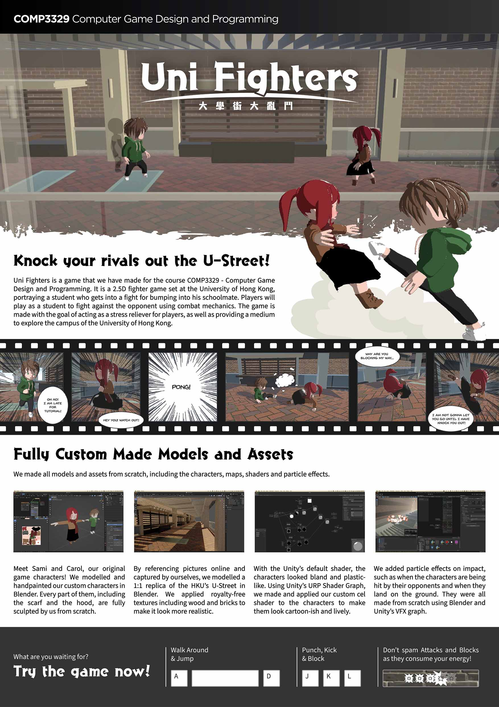
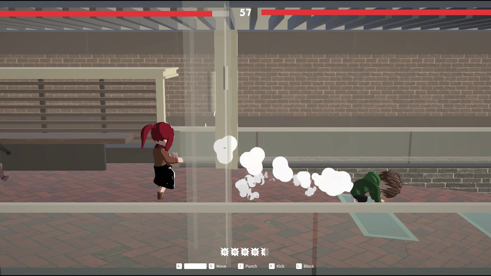
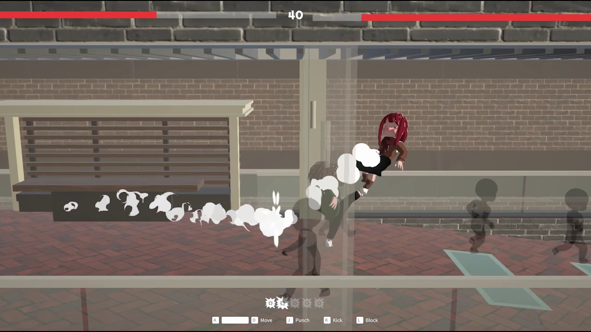
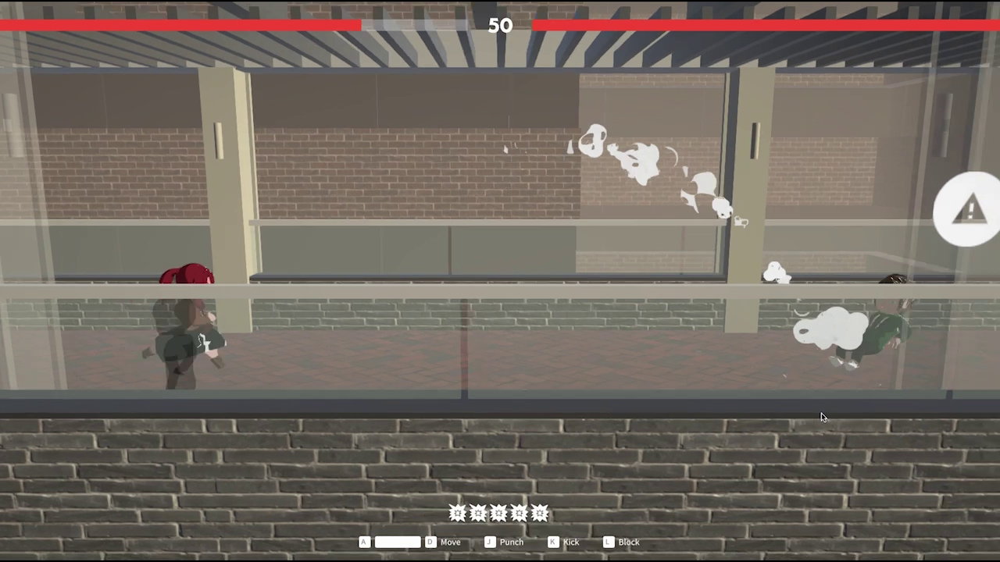
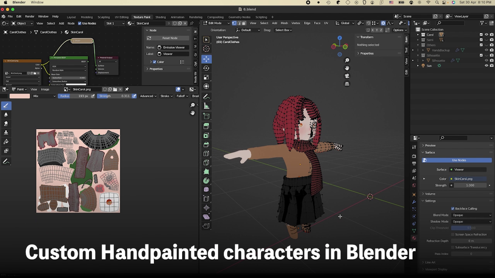
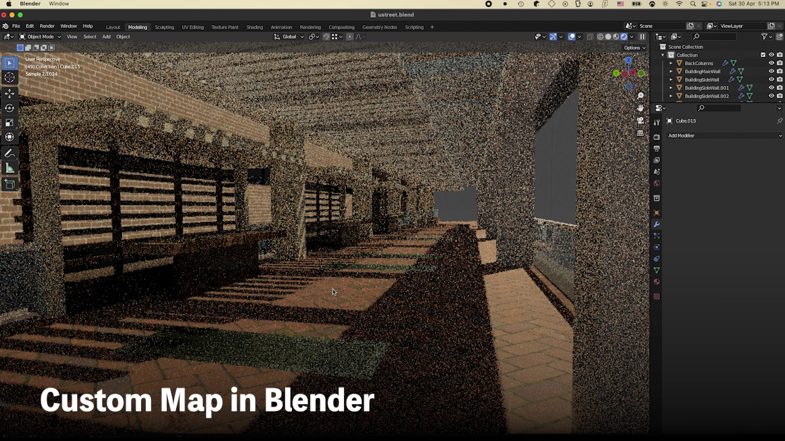

    

[Trailer](https://www.youtube.com/watch?v=-hSmOeRL0kw)

---

---

## Builds

- [https://github.com/justusip/smash/releases](https://github.com/justusip/smash/releases)
- Head to the latest build
- Download build_win_xxx for Windows and build_macos_xxx for MacOS.

## Screenshots

